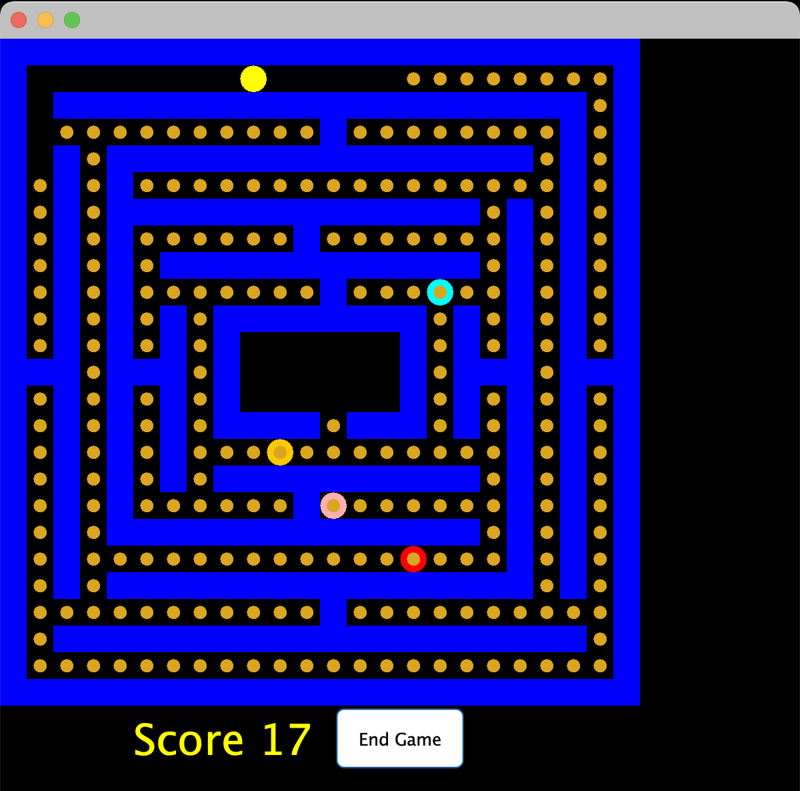

# Project 1: PacMan
By Michael Li, Jason Lavis, Chiayo Lin

## Image



## How To Run
```
javac -cp "src/" src/*.java
java -cp "src/" StartMenu
```

## Part 1a: PacMan Class

### get_valid_moves()

- **Implementation**: This method searches in all cardinal directions by 1 space to search for a position that contains the ```Map.Type``` Empty, Cookie, or Ghost, which are all valid moves. Returns the Locations of all valid moves, and nothing if there are no valid moves.
- **Test**: Initialized with a map loaded from a text file, we test that all valid moves returned satisfy conditions as said above that make it a valid move, and test that all invalid moves not return by this method are in-fact invalid. That is, we test that it must be a wall or an empty set.

### move()

- **Implementation**:
- **Test**:

### is_ghost_in_range()

- **Implementation**: This method returns true if there are any ghosts in a
                      attack range of radius 1, otherwise it returns false.
- **Test**: We test this method by iterating over a list of locations including
            both in-the-range and out-of-the-range locations to validate this
            method's ability to detect a ghost within its detection range.

### consume()

- **Implementation**: First get the set of components at the pacman's location. If the location contains a cookie, call `map.eatCookie` with the pacman's name as a parameter. Otherwise, return null.
- **Test**:  Written in `TestConsume.java`. The test first adds a Pacman and tries to call `consume` on the Pacman. However, it will return `null` since there is no cookie at that location. The test then adds a cookie at the Pacman's location and calls `consume` again. This time it will return the Cookie Component

## Part 1b: Ghost Class

### get_valid_moves()

- **Implementation**: This method searches in all cardinal directions by 1 space to search for a position that contains the ```Map.Type``` Empty, Cookie, Ghost, or Pacman which are all valid moves. Returns the Locations of all valid moves, and nothing if there are no valid moves.
- **Test**: Initialized with a map loaded from a text file, we test that all valid moves returned satisfy conditions as said above that make it a valid move, and test that all invalid moves not return by this method are in-fact invalid. That is, we test that it must be a wall or an empty set.

### move()

- **Implementation**:
- **Test**:

### is_pacman_in_range()

- **Implementation**: Create a hashset of locations to test: `(x+1, y), (x-1, y), (x, y+1), (x, y-1)`. For each location, check if the pacman is at that location. If so then return true. Else return false.
- **Tests**: Written in `TestPacManInRange.java`. The test places a Pacman at `(2,2)` and a Ghost at `(2, 1)`, then calls `is_pacman_in_range()` on this ghost, which is expected to return true. The test then places another Ghost at `(2, 2)`, then calls `is_pacman_in_range()` on this second ghost, which is expected to return false.

### attack()

- **Implementation**: This method invokes `Map->attack(Name)` instance method if
                      `is_pacman_in_range()` evaluates to true, otherwise it does
                      nothing and returns false.
- **Test**: We iterate over all possible valid and invalid locations of which a ghost may
            attack a pacman from to test this method.

## Map Class

### move(String name, Location loc, Type type)

- **Implementation**:
- **Test**:

### getLoc(Location loc)

- **Implementation**: This method, given a location, will return the type of location said location is. That is, it will return the ```field``` hashmap for the location, returning a hashset containing: Empty, Ghost, Pacman, Wall, Cookie.
- **Test**: We intialize a map by hand and check that the location type return matches what is should be.

### attack(String name)

- **Implementation**: This function updates the display and sets appropriate game
                      states when an attack of a ghost with the given name against
                      a pacman is successful, otherwise it returns false.
- **Test**: We iterate over all possible valid locations of which a ghost may attack
            a pacman from to test this method. Only valid locations are tested because
            it is only going to be called when an attack target is in range (i.e. from
            `Ghost->attack`).

### eatCookie(String Name)

- **Implementation**: First get the location of pacman's name. If the location contains a cookie, remove the cookie from the location, field, and components, increment `cookies`, and return the cookie component. Otherwise return null.
- **Test**: Written in `TestMapEatCookie.java`. The test first adds a Pacman and tries to call `eatCookie` on the map and Pacman. However, it will return `null` since there is no cookie at that location. The test then adds a cookie at the Pacman's location and calls `eatCookie` again. This time it will return the Cookie Component
